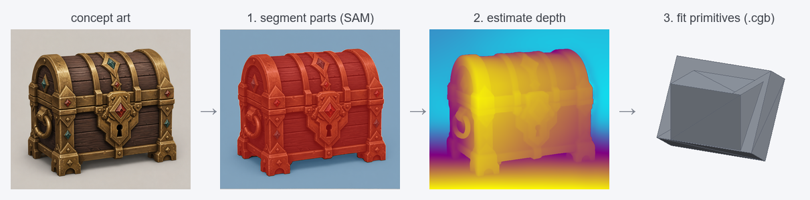
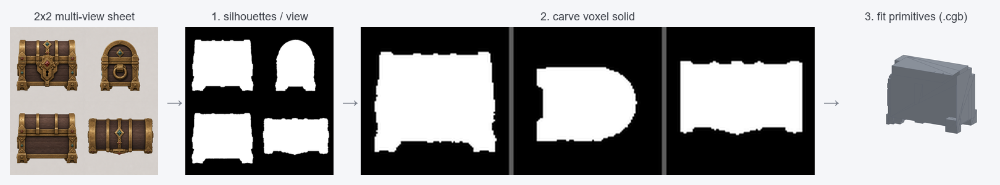
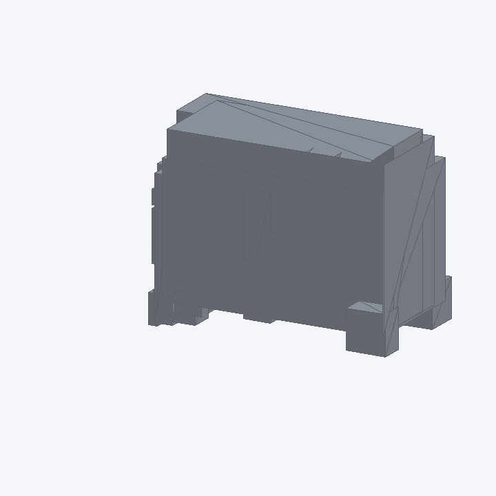

<!-- markdownlint-disable MD033 MD041 -->
<p align="center">
  
</p>
<h1 align="center">큐브공방 · CubeGB</h1>
<p align="center"><b>Image → editable parametric-primitive blockout.</b></p>
<p align="center">
  Turn a single image into a low-poly arrangement of cubes, cylinders, cones and
  spheres you can immediately edit in Blender — not a dense, un-editable mesh.
</p>
<p align="center">
  <a href="README.md">한국어</a> · <b>English</b>
</p>
<p align="center">
  <a href="#license">License: MIT</a> ·
  <a href="docs/cgb-format.md">.cgb format</a> ·
  <a href="#status">Status</a>
</p>

---

## What is CubeGB?

CubeGB ("큐브공방", *cube workshop*) is a lightweight **image-to-blockout**
generator. Given one image of a hard-surface object (furniture, buildings,
machines, props), it reconstructs it as a small set of **editable parametric
primitives** and writes a tiny `.cgb` JSON file.

**Why not just use Hunyuan3D / TRELLIS / Tripo?** Those produce high-density
textured meshes or Gaussian splats that are great to look at but painful to
*edit*. CubeGB instead targets the **blockout (greybox) stage** of a 3D
artist's workflow: it gives you clean primitives — KB-sized, axis-aligned,
named, and instantly re-editable in Blender — as a fast starting point you
refine by hand.

> **Scope.** CubeGB is intentionally specialized for **hard-surface, man-made
> objects**. It does *not* try to reconstruct organic forms (faces, animals,
> cloth), generate high-quality textures, or recover exact metric measurements
> from a single image — occluded surfaces are reasonably *estimated*.

## The core idea: `.cgb` is the source of truth

```
                 (recognition)            (bake)
   image  ───────────────────────►  .cgb  ─────────►  glTF / GLB / OBJ
                                      │
                                      │  (Blender add-on)
                                      └─────────────►  native editable primitives
```

- **`.cgb`** (parametric JSON) is the **single source of truth** — lossless,
  human-readable, `git diff`-friendly, kilobytes in size.
- Meshes (glTF/OBJ) are **derived artifacts** *baked* from `.cgb`.
- The **Blender add-on** restores `.cgb` as *real Blender primitives* (it does
  **not** bake them to mesh), so they stay grab-and-scale editable.

CubeGB is built **middle-out**: the downstream tooling (format → viewer → baker
→ importer) is complete and verifiable with hand-authored `.cgb` *first*, and
the AI recognition pipeline simply *fills in* that format. The whole skeleton
works even when recognition is imperfect.

## Repository layout

```
cubegb/
├── cgb/                 # .cgb format: JSON Schema, IO, validation
├── viewer/             # three.js single-file web viewer (index.html)
├── bake/               # .cgb → glTF/GLB/OBJ baker (low-poly)
├── blender_addon/      # Blender importer add-on (editable primitives)
├── recognition/        # image → .cgb: SAM segmentation, depth, primitive fitting
├── app/                # CubeGB Studio — all-in-one web GUI (FastAPI + three.js)
├── comfyui_nodes/      # ComfyUI custom nodes
├── samples/            # hand-authored .cgb examples (chair, table, building)
├── tests/              # pytest suite (format + baker)
└── docs/               # documentation
```

## What is it for?

CubeGB helps a **3D artist turn concept art into an editable, primitive-based
"first-pass blockout"** before diving into detailed modelling.

- **Blockout / greyboxing** — lock in proportions, silhouette and volume with
  primitives first; a human refines the details.
- **Hard-surface props & environments** — furniture, buildings, machines,
  weapons, chests, … (organic forms like faces/animals are out of scope).
- **Editability first** — unlike the dense meshes/splats from Hunyuan3D / TRELLIS,
  the output is KB-sized, axis-aligned, named primitives you can grab and tweak
  immediately in Blender.

## How an image becomes a `.cgb`

There are two paths; both converge on the same back end (**fit primitives →
`.cgb`**).

### 1) Single image (draft)



1. **Segment parts** — Segment Anything (SAM) splits the art into meaningful part
   masks (background removed, over-segmentation cleaned up).
2. **Estimate depth** — Depth Anything V2 produces a monocular depth map; each
   part is back-projected into a 3D point cloud.
3. **Fit primitives** — a cube / cylinder / cone / sphere is fitted per part. The
   **type is decided primarily from the 2D silhouette** (circularity, aspect,
   taper) — monocular depth alone can't tell a cube from a cylinder — then the
   pose is snapped to the world axes and the model is dropped onto the ground
   (`y=0`).

A single image only shows the front, so the **back and thickness are guessed** —
great for a fast draft.

### 2) Multi-view 2×2 sheet (precision, optional)



Supply front / side / back / top **as one 2×2 sheet** and the shape is *measured*
instead of guessed.

1. **Per-view silhouettes** — extract the object silhouette in each cell (blank
   cells are skipped, so accuracy scales with *how many faces you provide*).
2. **Space carving** — intersect the silhouettes at their known angles to carve a
   **voxel solid (visual hull)**. Thickness and footprint are measured for real
   (note the rounded lid surviving in the *side projection* above).
3. **Fit primitives** — the carved solid is turned into primitives the same way
   and saved as `.cgb`.

The blockout produced from the input above:

<p align="center"></p>

> Thin objects that collapse into a single blob from one image (e.g. a blade)
> keep their thickness with multi-view (blade thickness: single-view ≈ 0.69 →
> multi-view ≈ 0.03). In Studio, just add an **optional 2×2 sheet** alongside the
> main image and the precision path kicks in automatically.

## Install

CubeGB has a light **core** (format + baker + viewer tooling) and a heavy
**recognition** extra (PyTorch + SAM + Depth Anything).

```bash
# Core: enough to author/validate .cgb and bake meshes
python -m pip install -r requirements.txt        # Python 3.10+

# (Optional) recognition pipeline — large; a GPU is recommended
python -m pip install -r requirements.txt -r requirements-recognition.txt
```

Pretrained **model weights are downloaded separately** — see
[docs/recognition.en.md](docs/recognition.en.md).

## Quickstart

**All-in-one GUI (CubeGB Studio)** — select an image → generate `.cgb` → view in
3D → export, all on one page:

```bash
python -m pip install -r requirements.txt -r requirements-app.txt
python -m app.server        # opens http://127.0.0.1:8000/ in your browser
```

The Generate step needs the recognition stack + model weights, but **loading,
viewing, and exporting a `.cgb`** work with just the core. See [docs/studio.md](docs/studio.md).

**View a sample (standalone viewer)** — open [`viewer/index.html`](viewer/index.html)
in a browser and drag `samples/chair.cgb` onto the page (no server needed). See
[docs/viewer.md](docs/viewer.md).

## Generating `.cgb` from an image (recognition setup)

The "image → generate" step is AI inference, so it needs a heavier dependency
set and **pretrained model weights** that are not part of the core install.
Follow the steps below to enable the **Generate** button in Studio and the
`recognition.fit` CLI.

### 1) Install the recognition dependencies

```bash
pip install -r requirements.txt -r requirements-recognition.txt
```

- Installs PyTorch · torchvision · OpenCV · transformers · Segment Anything (SAM).
- **GPU**: on Apple Silicon, PyTorch uses **MPS** automatically; with an NVIDIA
  GPU it uses **CUDA**. CPU works too, just slowly.
- `open3d` is only used to export debug point clouds (`.ply`) and is **not
  required** for generation (it may have no wheel on very new Python, so it's
  optional).

### 2) Download a SAM checkpoint

SAM weights are large and downloaded manually. Pick one (accuracy ↔ speed/size):

| Model | File | Size | Download URL |
|---|---|---|---|
| `vit_h` (accurate) | `sam_vit_h_4b8939.pth` | ~2.4GB | https://dl.fbaipublicfiles.com/segment_anything/sam_vit_h_4b8939.pth |
| `vit_l` (medium) | `sam_vit_l_0b3195.pth` | ~1.2GB | https://dl.fbaipublicfiles.com/segment_anything/sam_vit_l_0b3195.pth |
| `vit_b` (light) | `sam_vit_b_01ec64.pth` | ~375MB | https://dl.fbaipublicfiles.com/segment_anything/sam_vit_b_01ec64.pth |

e.g. download `vit_h` into `models/`:

```bash
mkdir -p models
curl -L -o models/sam_vit_h_4b8939.pth \
  https://dl.fbaipublicfiles.com/segment_anything/sam_vit_h_4b8939.pth
```

### 3) Depth model — auto-downloaded (nothing to do)

Depth Anything V2 (small) is fetched automatically from Hugging Face by
`transformers` on first run (`depth-anything/Depth-Anything-V2-Small-hf`,
~100MB). No manual step.

### 4) Point to the checkpoint and run

Set it via an environment variable (recommended), or type the path into Studio's
*Generate options*.

```bash
export CUBEGB_SAM_CHECKPOINT=$PWD/models/sam_vit_h_4b8939.pth
python -m app.server          # then drop an image in Studio → Generate
```

Or via the CLI:

```bash
python -m recognition.fit photo.jpg \
  --sam-checkpoint models/sam_vit_h_4b8939.pth \
  --sam-model-type vit_h --out result.cgb
```

`--sam-model-type` must match the checkpoint you downloaded (`vit_h`/`vit_l`/`vit_b`).

### Notes

- **Apple Silicon**: SAM does not support MPS (a float64 limitation), so it runs
  on **CPU automatically** (the depth model still uses MPS). `vit_h` on CPU can
  be slow — use `vit_b` for quick tests.
- A single image only shows front surfaces, so hidden geometry is **estimated** —
  the output is an editable blockout, not an exact reconstruction.
- Model licenses (SAM Apache-2.0, Depth Anything varies by variant) — see
  [Model & data licenses](#model--data-licenses) and
  [docs/recognition.en.md](docs/recognition.en.md).

**Bake a `.cgb` to a mesh:**

```bash
python -m bake.baker samples/chair.cgb --format glb --out chair.glb
python -m bake.baker samples/table.cgb --format obj --out table.obj
```

**Import into Blender** — install [`blender_addon/cubegb_import.py`](blender_addon/cubegb_import.py)
and use *File ▸ Import ▸ CubeGB (.cgb)*. See [docs/blender-addon.md](docs/blender-addon.md).

**Generate `.cgb` from an image** (needs the recognition extra + model weights):

```bash
python -m recognition.fit photo.jpg --sam-checkpoint sam_vit_h_4b8939.pth --out result.cgb
```

**In ComfyUI** — clone this repo into `ComfyUI/custom_nodes/` and use the
**CubeGB Generate / Save / Bake / Preview** nodes. See [docs/comfyui.md](docs/comfyui.md).

## Status

CubeGB is developed in phases (see [docs/cgb-format.md](docs/cgb-format.md) and
the per-component docs). Phases 0–3 (the downstream skeleton) are testable
without any ML; Phases 4–6 add recognition and packaging.

| Phase | Component | State |
|---|---|---|
| 0 | `.cgb` format, IO, validation, samples | ✅ tested |
| 1 | three.js web viewer | ✅ |
| 2 | mesh baker (glTF/OBJ) | ✅ tested |
| 3 | Blender importer add-on | ✅ |
| 4 | segmentation (SAM) + depth (Depth Anything V2) | ✅ code (needs weights) |
| 5 | primitive fitting & pose normalization → `.cgb` | ✅ code (needs weights) |
| 6 | ComfyUI custom nodes | ✅ |
| — | CubeGB Studio (all-in-one web GUI, beyond the original spec) | ✅ view/export tested |
| — | Multi-view 2×2 sheet precision mode (space carving → primitives) | ✅ tested |

Run the test suite:

```bash
python -m pytest
```

## Documentation

- [The `.cgb` format](docs/cgb-format.md) — spec & geometry conventions
- [CubeGB Studio (all-in-one GUI)](docs/studio.md)
- [Web viewer](docs/viewer.md)
- [Mesh baker](docs/baker.md)
- [Blender add-on](docs/blender-addon.md)
- [Recognition pipeline](docs/recognition.en.md)
- [ComfyUI nodes](docs/comfyui.md)
- [Contributing](CONTRIBUTING.md)

## Model & data licenses

CubeGB's own code is **MIT**. The recognition pipeline relies on third-party
pretrained models — **you are responsible for complying with their licenses**:

| Model | Use | License |
|---|---|---|
| [Segment Anything (SAM)](https://github.com/facebookresearch/segment-anything) | segmentation | Apache-2.0 |
| [Depth Anything V2](https://github.com/DepthAnything/Depth-Anything-V2) | depth | varies by variant — **verify before redistribution/commercial use** |
| [MiDaS](https://github.com/isl-org/MiDaS) | depth (fallback) | MIT |

See [docs/recognition.en.md](docs/recognition.en.md) for checkpoint download
instructions and license notes.

## License

MIT — see [LICENSE](LICENSE).

## Trademark

**“큐브공방 / CubeGB”** (the name and logo) is a registered trademark. The MIT
license covers the **source code** only; it does **not** grant rights to use the
“큐브공방 / CubeGB” name or logo. You may use the software under the MIT terms,
but please do not use the project name or logo in a way that implies endorsement
or affiliation without permission. The logo in [`images/`](images/) is provided
for referring to this project, not for redistribution as your own mark.
