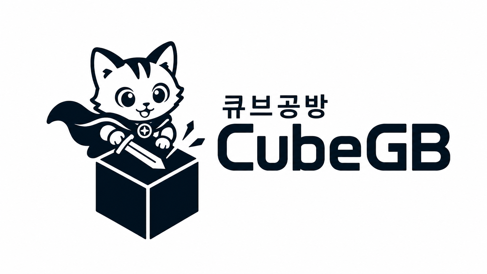

<!-- markdownlint-disable MD033 MD041 -->
<p align="center">
  
</p>
<h1 align="center">큐브공방 · CubeGB</h1>
<p align="center"><b>이미지 → 편집 가능한 파라메트릭 프리미티브 블록아웃</b></p>
<p align="center">
  이미지 한 장을 큐브·실린더·콘·스피어의 저폴리 조합으로 분해해, 무겁고 편집이
  어려운 메쉬가 아니라 <b>Blender에서 바로 편집 가능한 프리미티브</b>로 만들어 줍니다.
</p>
<p align="center">
  <b>한국어</b> · <a href="README.en.md">English</a>
</p>
<p align="center">
  <a href="#라이선스">License: MIT</a> ·
  <a href="docs/cgb-format.md">.cgb 포맷</a> ·
  <a href="#개발-현황">개발 현황</a>
</p>

---

## CubeGB란?

CubeGB(**큐브공방**, *cube workshop*)는 초경량 **이미지 → 블록아웃(blockout)**
생성기입니다. 하드서피스(가구·건물·기계·소품 등 인공물) 이미지 한 장을 입력받아,
**편집 가능한 파라메트릭 프리미티브**의 조합으로 재구성하고 아주 작은 `.cgb` JSON
파일로 저장합니다.

**Hunyuan3D / TRELLIS / Tripo 같은 도구와 무엇이 다른가요?** 그런 모델들은 보기엔
좋지만 *편집*하기 까다로운 고밀도 텍스처 메쉬나 가우시안 스플랫을 출력합니다.
CubeGB는 대신 3D 아티스트 작업 흐름의 **블록아웃(그레이박스) 단계**를 겨냥합니다 —
KB 단위, 축에 정렬되고, 이름이 붙어 있으며, Blender에서 즉시 다시 편집할 수 있는
깔끔한 프리미티브를 **빠른 출발점**으로 제공해, 디테일은 사람이 다듬습니다.

> **스코프.** CubeGB는 의도적으로 **하드서피스(인공물)** 에 특화되어 있습니다.
> 유기적 형태(얼굴·동식물·천 등)의 정밀 복원, 고품질 텍스처 생성, 단일 이미지로부터의
> 정확한 실측 복원은 다루지 않으며 — 가려진 면은 합리적으로 *추정*합니다.

## 핵심 아이디어: `.cgb`가 원본(source of truth)

```
                  (인식)                  (베이크)
   이미지  ───────────────────────►  .cgb  ─────────►  glTF / GLB / OBJ
                                      │
                                      │  (Blender 애드온)
                                      └─────────────►  편집 가능한 네이티브 프리미티브
```

- **`.cgb`**(파라메트릭 JSON)는 **유일한 원본**입니다 — 무손실, 사람이 읽을 수 있고,
  `git diff`에 친화적이며, 파일 크기는 킬로바이트 단위입니다.
- 메쉬(glTF/OBJ)는 `.cgb`에서 **구워낸(bake) 파생물**입니다.
- **Blender 애드온**은 `.cgb`를 *실제 Blender 프리미티브*로 복원합니다(메쉬로 굽지
  **않음**). 그래서 잡고 스케일·이동하는 편집성이 그대로 유지됩니다.

CubeGB는 **미들아웃(middle-out)** 방식으로 만들어졌습니다: 어려운 인식(AI)을 먼저
만들지 않고, 다운스트림 도구(포맷 → 뷰어 → 베이커 → 임포터)를 손으로 작성한 `.cgb`로
**먼저** 완성·검증한 뒤, AI 인식 파이프라인이 이 포맷을 *채우게* 합니다. 인식이
불완전해도 전체 골격이 동작합니다.

## 리포지토리 구조

```
cubegb/
├── cgb/                 # .cgb 포맷: JSON 스키마, IO, 검증
├── viewer/             # three.js 단일 HTML 웹 뷰어 (index.html)
├── bake/               # .cgb → glTF/GLB/OBJ 베이커 (저폴리)
├── blender_addon/      # Blender 임포터 애드온 (편집 가능 프리미티브)
├── recognition/        # 이미지 → .cgb: SAM 세분화, 깊이 추정, 프리미티브 피팅
├── app/                # CubeGB Studio — 올인원 웹 GUI (FastAPI + three.js)
├── comfyui_nodes/      # ComfyUI 커스텀 노드
├── samples/            # 손으로 작성한 .cgb 예제 (의자, 탁자, 건물)
├── tests/              # pytest 테스트 (포맷 + 베이커)
└── docs/               # 문서
```

## 설치

CubeGB는 가벼운 **코어**(포맷 + 베이커 + 뷰어 도구)와 무거운 **인식(recognition)**
옵션(PyTorch + SAM + Depth Anything)으로 나뉩니다.

```bash
# 코어: .cgb 작성/검증 및 메쉬 베이크에 필요
python -m pip install -r requirements.txt        # Python 3.10+

# (선택) 인식 파이프라인 — 용량이 크며 GPU 권장
python -m pip install -r requirements.txt -r requirements-recognition.txt
```

사전학습 **모델 가중치는 별도로 내려받습니다** — [docs/recognition.md](docs/recognition.md) 참고.

## 빠른 시작

**올인원 GUI (CubeGB Studio)** — 이미지 선택 → `.cgb` 생성 → 3D 뷰 → 내보내기를
한 화면에서:

```bash
python -m pip install -r requirements.txt -r requirements-app.txt
python -m app.server        # 브라우저에서 http://127.0.0.1:8000/ 자동 열림
```

생성 단계는 인식 스택 + 모델 가중치가 필요하지만, **`.cgb` 불러오기 → 보기 →
내보내기**는 코어만으로 동작합니다. [docs/studio.md](docs/studio.md) 참고.

**샘플 보기 (단독 뷰어)** — [`viewer/index.html`](viewer/index.html)을 브라우저에서
열고 `samples/chair.cgb`를 페이지에 드래그하세요(서버 불필요).
[docs/viewer.md](docs/viewer.md) 참고.

**`.cgb`를 메쉬로 베이크:**

```bash
python -m bake.baker samples/chair.cgb --format glb --out chair.glb
python -m bake.baker samples/table.cgb --format obj --out table.obj
```

**Blender로 임포트** — [`blender_addon/cubegb_import.py`](blender_addon/cubegb_import.py)을
설치하고 *File ▸ Import ▸ CubeGB (.cgb)* 메뉴를 사용하세요.
[docs/blender-addon.md](docs/blender-addon.md) 참고.

**이미지에서 `.cgb` 생성**(인식 옵션 + 모델 가중치 필요):

```bash
python -m recognition.fit photo.jpg --sam-checkpoint sam_vit_h_4b8939.pth --out result.cgb
```

**ComfyUI에서** — 이 리포를 `ComfyUI/custom_nodes/`에 클론한 뒤
**CubeGB Generate / Save / Bake / Preview** 노드를 사용하세요.
[docs/comfyui.md](docs/comfyui.md) 참고.

## 개발 현황

CubeGB는 단계(Phase)별로 개발됩니다([docs/cgb-format.md](docs/cgb-format.md) 및
컴포넌트별 문서 참고). Phase 0–3(다운스트림 골격)은 ML 없이 검증 가능하며,
Phase 4–6에서 인식과 패키징을 더합니다.

| Phase | 컴포넌트 | 상태 |
|---|---|---|
| 0 | `.cgb` 포맷, IO, 검증, 샘플 | ✅ 테스트됨 |
| 1 | three.js 웹 뷰어 | ✅ |
| 2 | 메쉬 베이커 (glTF/OBJ) | ✅ 테스트됨 |
| 3 | Blender 임포터 애드온 | ✅ |
| 4 | 세분화(SAM) + 깊이(Depth Anything V2) | ✅ 코드 (가중치 필요) |
| 5 | 프리미티브 피팅 & 자세 정규화 → `.cgb` | ✅ 코드 (가중치 필요) |
| 6 | ComfyUI 커스텀 노드 | ✅ |
| — | CubeGB Studio (올인원 웹 GUI, 요청서 외 추가) | ✅ 뷰/내보내기 테스트됨 |

테스트 실행:

```bash
python -m pytest
```

## 문서

- [`.cgb` 포맷](docs/cgb-format.md) — 스펙 & 기하 규약
- [CubeGB Studio (올인원 GUI)](docs/studio.md)
- [웹 뷰어](docs/viewer.md)
- [메쉬 베이커](docs/baker.md)
- [Blender 애드온](docs/blender-addon.md)
- [인식 파이프라인](docs/recognition.md)
- [ComfyUI 노드](docs/comfyui.md)
- [기여 가이드](CONTRIBUTING.md)

> 문서는 현재 영어로 작성되어 있습니다(코드 주석 포함). 한국어 문서는 점진적으로 추가될 예정입니다.

## 모델 & 데이터 라이선스

CubeGB 본체 코드는 **MIT**입니다. 인식 파이프라인은 서드파티 사전학습 모델에
의존하며 — **각 모델의 라이선스 준수 책임은 사용자에게 있습니다**:

| 모델 | 용도 | 라이선스 |
|---|---|---|
| [Segment Anything (SAM)](https://github.com/facebookresearch/segment-anything) | 세분화 | Apache-2.0 |
| [Depth Anything V2](https://github.com/DepthAnything/Depth-Anything-V2) | 깊이 추정 | 변형별 상이 — **재배포·상업적 사용 전 반드시 확인** |
| [MiDaS](https://github.com/isl-org/MiDaS) | 깊이 추정(폴백) | MIT |

체크포인트 다운로드 안내와 라이선스 주의는 [docs/recognition.md](docs/recognition.md)를 참고하세요.

## 라이선스

MIT — [LICENSE](LICENSE) 참고.

## 상표권

**“큐브공방 / CubeGB”**(이름 및 로고)는 등록 상표입니다. MIT 라이선스는 **소스 코드**에만
적용되며, “큐브공방 / CubeGB” 이름이나 로고를 사용할 권리를 부여하지 **않습니다**. MIT
조건 하에 소프트웨어는 자유롭게 사용할 수 있으나, 허가 없이 프로젝트 이름·로고를
보증이나 제휴를 암시하는 방식으로 사용하지 말아 주세요. [`images/`](images/)의 로고는
이 프로젝트를 가리키기 위한 것이며 자신의 상표로 재배포하기 위한 것이 아닙니다.
