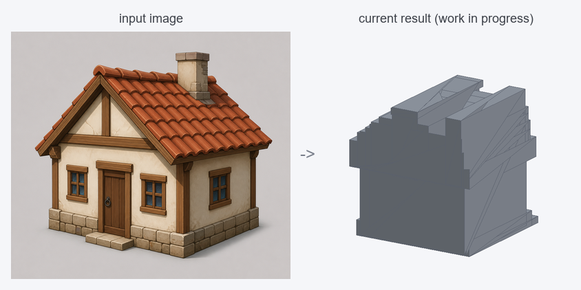

<!-- markdownlint-disable MD033 MD041 -->
<p align="center">
  
</p>
<h1 align="center">큐브공방 · CubeGB</h1>
<p align="center"><b>이미지 → 편집 가능한 파라메트릭 프리미티브 블록아웃</b></p>
<p align="center">
  이미지 한 장을 큐브·실린더·콘·스피어의 저폴리 조합으로 분해해, 무겁고 편집이
  어려운 메쉬가 아니라 <b>Blender에서 바로 편집 가능한 프리미티브</b>로 만들어 줍니다.
</p>
<p align="center">
  <b>한국어</b> · <a href="README.en.md">English</a>
</p>
<p align="center">
  <a href="#라이선스">License: MIT</a> ·
  <a href="docs/cgb-format.md">.cgb 포맷</a> ·
  <a href="#개발-현황">개발 현황</a>
</p>

---

> ⚠️ **개발 중 (Work in progress).** CubeGB는 활발히 개발 중이며, 아직
> **바로 쓸 수 있는 수준의 결과를 보장하지 않습니다.** 현재는 전체 형태(실루엣·비율)는
> 잡지만 프리미티브(큐브)가 서로 겹쳐 거칠고, 그대로 편집하기엔 번거롭습니다. 단일 이미지보다
> **멀티뷰(2×2 시트)** 경로가 더 나은 결과를 줍니다. 품질은 점진적으로 개선 중입니다.
>
> 

## CubeGB란?

CubeGB(**큐브공방**, *cube workshop*)는 초경량 **이미지 → 블록아웃(blockout)**
생성기입니다. 하드서피스(가구·건물·기계·소품 등 인공물) 이미지 한 장을 입력받아,
**편집 가능한 파라메트릭 프리미티브**의 조합으로 재구성하고 아주 작은 `.cgb` JSON
파일로 저장합니다.

**Hunyuan3D / TRELLIS / Tripo 같은 도구와 무엇이 다른가요?** 그런 모델들은 보기엔
좋지만 *편집*하기 까다로운 고밀도 텍스처 메쉬나 가우시안 스플랫을 출력합니다.
CubeGB는 대신 3D 아티스트 작업 흐름의 **블록아웃(그레이박스) 단계**를 겨냥합니다 —
KB 단위, 축에 정렬되고, 이름이 붙어 있으며, Blender에서 즉시 다시 편집할 수 있는
깔끔한 프리미티브를 **빠른 출발점**으로 제공해, 디테일은 사람이 다듬습니다.

> **스코프.** CubeGB는 의도적으로 **하드서피스(인공물)** 에 특화되어 있습니다.
> 유기적 형태(얼굴·동식물·천 등)의 정밀 복원, 고품질 텍스처 생성, 단일 이미지로부터의
> 정확한 실측 복원은 다루지 않으며 — 가려진 면은 합리적으로 *추정*합니다.

## 핵심 아이디어: `.cgb`가 원본(source of truth)

```
                  (인식)                  (베이크)
   이미지  ───────────────────────►  .cgb  ─────────►  glTF / GLB / OBJ
                                      │
                                      │  (Blender 애드온)
                                      └─────────────►  편집 가능한 네이티브 프리미티브
```

- **`.cgb`**(파라메트릭 JSON)는 **유일한 원본**입니다 — 무손실, 사람이 읽을 수 있고,
  `git diff`에 친화적이며, 파일 크기는 킬로바이트 단위입니다.
- 메쉬(glTF/OBJ)는 `.cgb`에서 **구워낸(bake) 파생물**입니다.
- **Blender 애드온**은 `.cgb`를 *실제 Blender 프리미티브*로 복원합니다(메쉬로 굽지
  **않음**). 그래서 잡고 스케일·이동하는 편집성이 그대로 유지됩니다.

CubeGB는 **미들아웃(middle-out)** 방식으로 만들어졌습니다: 어려운 인식(AI)을 먼저
만들지 않고, 다운스트림 도구(포맷 → 뷰어 → 베이커 → 임포터)를 손으로 작성한 `.cgb`로
**먼저** 완성·검증한 뒤, AI 인식 파이프라인이 이 포맷을 *채우게* 합니다. 인식이
불완전해도 전체 골격이 동작합니다.

## 표현력: 디포메이션 & 불리언 (프리미티브를 넘어서)

기본 4종 프리미티브에 더해, `.cgb`는 작은 파라미터만으로 표현력을 크게 넓힙니다
(모두 **선택적** — 없으면 기존과 100% 동일하게 동작):

- **부분 스윕(partial sweep)** — 실린더·콘을 일부 각도만 그려 곡면 뚜껑·아치·곡면 견갑.
- **디포메이션(`deform`)** — `taper`(끝을 좁혀 칼날·다리·기둥), `bevel`(모서리를 깎아
  각진 느낌↓), `shear`(기울여 비스듬한 지붕·받침).
- **불리언/CSG(`operations`)** — `difference`/`union`/`intersection`을 **선언적으로**
  저장하고 베이크 때 **한 번** 계산(검증된 [manifold](https://github.com/elalish/manifold)
  백엔드). 구멍·홈·음각 문장(자물쇠 구멍, 관통 홀, 서랍 홈 등).

> 변형 수학은 베이커·웹 뷰어·Blender 애드온이 **동일 공식**을 공유해 미리보기와 베이크가
> 일치합니다. 불리언은 실시간 뷰어에선 빼기용(cutter)을 반투명 빨강으로만 표시하고, 실제
> 메쉬 연산은 베이크 시 한 번만 수행합니다. 모든 기능을 함께 쓴 예:
> [`samples/cat_knight_master.cgb`](samples/cat_knight_master.cgb). 규약 전체는
> [.cgb 포맷 문서](docs/cgb-format.md)를 참고하세요.

## 리포지토리 구조

```
cubegb/
├── cgb/                 # .cgb 포맷: JSON 스키마, IO, 검증
├── viewer/             # three.js 단일 HTML 웹 뷰어 (index.html)
├── bake/               # .cgb → glTF/GLB/OBJ 베이커 (저폴리)
├── blender_addon/      # Blender 임포터 애드온 (편집 가능 프리미티브)
├── recognition/        # 이미지 → .cgb: SAM 세분화, 깊이 추정, 프리미티브 피팅
├── app/                # CubeGB Studio — 올인원 웹 GUI (FastAPI + three.js)
├── comfyui_nodes/      # ComfyUI 커스텀 노드
├── samples/            # 손으로 작성한 .cgb 예제 (의자·탁자·건물, 보물상자, 자물쇠, 고양이기사)
├── tests/              # pytest 테스트 (포맷 + 베이커)
└── docs/               # 문서
```

## 어디에 쓰나요

CubeGB는 **3D 모델러가 원화(컨셉 아트)를 받아 세부 모델링에 들어가기 전, 편집 가능한
프리미티브로 된 "초벌 블록아웃"을 빠르게 얻는** 도구입니다.

- **블록아웃 / 그레이박싱** — 비례·실루엣·부피를 먼저 프리미티브로 잡고 디테일은 사람이 다듬습니다.
- **하드서피스 소품·환경** — 가구·건물·기계·무기·상자 등 인공물. (얼굴·동식물 등 유기적 형태는 스코프 밖)
- **편집성 우선** — Hunyuan3D / TRELLIS 같은 고밀도 메시·스플랫과 달리, KB 단위의 축 정렬·
  이름 붙은 프리미티브라 Blender에서 즉시 잡고 수정합니다.

## 이미지에서 `.cgb`가 만들어지는 원리

두 가지 경로가 있고, 둘 다 같은 후반부(**프리미티브 피팅 → `.cgb`**)로 수렴합니다.

### 1) 단일 이미지 (드래프트)


1. **부위 분할** — Segment Anything(SAM)으로 원화를 의미 있는 부위 마스크로 나눕니다
   (배경 제거 · 과분할 정리).
2. **깊이 추정** — Depth Anything V2로 단안 깊이맵을 만들어 각 부위를 3D 점군으로 역투영합니다.
3. **프리미티브 피팅** — 부위마다 큐브·실린더·콘·스피어를 맞춥니다. **타입은 2D 실루엣**
   (원형도·종횡비·테이퍼)을 1차 근거로 정하고(단안 깊이만으론 큐브/실린더 구분이 어렵기 때문),
   자세는 월드 축에 정렬하고 바닥(`y=0`)에 안착시킵니다.

단일 이미지는 앞면만 보이므로 **뒷면·두께는 추정**합니다 — 빠른 초안에 적합합니다.

### 2) 멀티뷰 2×2 시트 (정밀 · 선택)


front / side / back / top **네 방향을 한 장(2×2)**으로 함께 넣으면, 추정 대신 **실측**합니다.

1. **뷰별 실루엣** — 각 칸에서 물체 실루엣을 추출합니다(빈 칸은 건너뛰어 *아는 면만큼* 정확도가 올라갑니다).
2. **공간 카빙(space carving)** — 알려진 각도로 실루엣들을 교차시켜 **복셀 솔리드(visual hull)**를
   깎아냅니다. 각 복셀의 색은 **그 면을 바라보는 뷰(front/side/back/top)에서 샘플링**해 옆·뒷면 색까지
   살립니다(해상도 96~512 선택).
3. **추상화(shape abstraction)** — 깎인 솔리드를 부위별로 재귀 분해해 **큐브·실린더·콘·스피어** 중
   잔차(IoU)가 가장 낮은 타입으로 치환합니다. 겹침이 거의 없고 둥근 부위는 실린더/콘으로 나옵니다.

위 입력으로 만들어진 블록아웃:

<p align="center"></p>

**CubeGB Studio 디버그 뷰** — 한 화면에서 카빙 복셀·최종 프리미티브·오브젝트 그룹을 나란히 봅니다:


> 단일 이미지에서 통짜로 뭉치던 얇은 물체(예: 칼날)도 멀티뷰에선 두께가 살아납니다
> (검 두께: 단일뷰 ≈ 0.69 → 멀티뷰 ≈ 0.03). Studio에서는 메인 이미지에 더해
> **선택적으로 2×2 시트**를 올리면 자동으로 정밀 모드로 동작합니다.

## 설치

CubeGB는 가벼운 **코어**(포맷 + 베이커 + 뷰어 도구)와 무거운 **인식(recognition)**
옵션(PyTorch + SAM + Depth Anything)으로 나뉩니다.

```bash
# 코어: .cgb 작성/검증 및 메쉬 베이크에 필요
python -m pip install -r requirements.txt        # Python 3.10+

# (선택) 인식 파이프라인 — 용량이 크며 GPU 권장
python -m pip install -r requirements.txt -r requirements-recognition.txt
```

사전학습 **모델 가중치는 별도로 내려받습니다** — [docs/recognition.md](docs/recognition.md) 참고.

## 빠른 시작

**올인원 GUI (CubeGB Studio)** — 이미지 선택 → `.cgb` 생성 → 3D 뷰 → 내보내기를
한 화면에서:

```bash
python -m pip install -r requirements.txt -r requirements-app.txt
python -m app.server        # 브라우저에서 http://127.0.0.1:8000/ 자동 열림
```

생성 단계는 인식 스택 + 모델 가중치가 필요하지만, **`.cgb` 불러오기 → 보기 →
내보내기**는 코어만으로 동작합니다. [docs/studio.md](docs/studio.md) 참고.

**샘플 보기 (단독 뷰어)** — [`viewer/index.html`](viewer/index.html)을 브라우저에서
열고 `samples/chair.cgb`를 페이지에 드래그하세요(서버 불필요).
[docs/viewer.md](docs/viewer.md) 참고.

## 이미지 → `.cgb` 생성 (인식 파이프라인 설치)

"이미지 → 생성"은 AI 추론 단계라 별도의 무거운 의존성과 **사전학습 모델 가중치**가
필요합니다. 코어 설치에는 포함되지 않으니, 아래 순서대로 설치하면 Studio의
**생성(Generate)** 버튼과 `recognition.fit` CLI가 동작합니다.

### 1) 인식 의존성 설치

```bash
pip install -r requirements.txt -r requirements-recognition.txt
```

- 설치 항목: PyTorch · torchvision · OpenCV · transformers · Segment Anything(SAM).
- **GPU**: Apple Silicon(M 시리즈)은 PyTorch가 자동으로 **MPS**(GPU 가속)를 사용하고,
  NVIDIA GPU가 있으면 **CUDA**를 사용합니다. GPU가 없으면 CPU로도 되지만 느립니다.
- `open3d`는 디버그용 점군(`.ply`) 저장에만 쓰여 **생성에는 불필요**합니다(아주 최신
  파이썬에선 휠이 없을 수 있어 선택 설치).

### 2) SAM 체크포인트 다운로드

SAM 가중치는 용량이 커서 직접 받아야 합니다. 셋 중 하나를 고르세요(정확도 ↔ 속도·용량):

| 모델 | 파일 | 크기 | 다운로드 URL |
|---|---|---|---|
| `vit_h` (정확) | `sam_vit_h_4b8939.pth` | ~2.4GB | https://dl.fbaipublicfiles.com/segment_anything/sam_vit_h_4b8939.pth |
| `vit_l` (중간) | `sam_vit_l_0b3195.pth` | ~1.2GB | https://dl.fbaipublicfiles.com/segment_anything/sam_vit_l_0b3195.pth |
| `vit_b` (가벼움) | `sam_vit_b_01ec64.pth` | ~375MB | https://dl.fbaipublicfiles.com/segment_anything/sam_vit_b_01ec64.pth |

예) `vit_h`를 `models/`에 받기:

```bash
mkdir -p models
curl -L -o models/sam_vit_h_4b8939.pth \
  https://dl.fbaipublicfiles.com/segment_anything/sam_vit_h_4b8939.pth
```

### 3) 깊이 모델 — 자동 다운로드 (할 일 없음)

Depth Anything V2(small)는 `transformers`가 **첫 실행 때 Hugging Face에서 자동으로**
받습니다(`depth-anything/Depth-Anything-V2-Small-hf`, ~100MB). 별도 작업이 없습니다.

### 4) 체크포인트 경로 지정 후 실행

환경변수로 미리 지정하거나(권장), Studio의 *생성 옵션*에 경로를 직접 입력합니다.

```bash
export CUBEGB_SAM_CHECKPOINT=$PWD/models/sam_vit_h_4b8939.pth
python -m app.server          # Studio에서 이미지 드롭 → 생성
```

또는 CLI로:

```bash
python -m recognition.fit photo.jpg \
  --sam-checkpoint models/sam_vit_h_4b8939.pth \
  --sam-model-type vit_h --out result.cgb
```

`--sam-model-type`은 받은 체크포인트와 맞춰야 합니다(`vit_h`/`vit_l`/`vit_b`).

### 참고 · 주의

- **Apple Silicon**: SAM은 MPS를 지원하지 않아(float64 제약) **자동으로 CPU에서**
  실행됩니다(깊이 모델은 MPS 사용). `vit_h`는 CPU 추론이 느릴 수 있으니, 빠른 테스트는
  `vit_b`를 권장합니다.
- 단일 이미지라 가려진 뒷면은 **추정**됩니다 — 결과는 정밀 복원이 아니라 "편집
  출발점이 되는 블록아웃"입니다.
- 모델 라이선스(SAM Apache-2.0, Depth Anything 변형별 상이)는 아래
  [모델 & 데이터 라이선스](#모델--데이터-라이선스)와 [docs/recognition.md](docs/recognition.md)를
  확인하세요.

**`.cgb`를 메쉬로 베이크:**

```bash
python -m bake.baker samples/chair.cgb --format glb --out chair.glb
python -m bake.baker samples/table.cgb --format obj --out table.obj
```

**Blender로 임포트** — [`blender_addon/cubegb_import.py`](blender_addon/cubegb_import.py)을
설치하고 *File ▸ Import ▸ CubeGB (.cgb)* 메뉴를 사용하세요.
[docs/blender-addon.md](docs/blender-addon.md) 참고.

**이미지에서 `.cgb` 생성**(인식 옵션 + 모델 가중치 필요):

```bash
python -m recognition.fit photo.jpg --sam-checkpoint sam_vit_h_4b8939.pth --out result.cgb
```

**ComfyUI에서** — 이 리포를 `ComfyUI/custom_nodes/`에 클론한 뒤
**CubeGB Generate / Save / Bake / Preview** 노드를 사용하세요.
[docs/comfyui.md](docs/comfyui.md) 참고.

## 개발 현황

CubeGB는 단계(Phase)별로 개발됩니다([docs/cgb-format.md](docs/cgb-format.md) 및
컴포넌트별 문서 참고). Phase 0–3(다운스트림 골격)은 ML 없이 검증 가능하며,
Phase 4–6에서 인식과 패키징을 더합니다.

| Phase | 컴포넌트 | 상태 |
|---|---|---|
| 0 | `.cgb` 포맷, IO, 검증, 샘플 | ✅ 테스트됨 |
| 1 | three.js 웹 뷰어 | ✅ |
| 2 | 메쉬 베이커 (glTF/OBJ) | ✅ 테스트됨 |
| 3 | Blender 임포터 애드온 | ✅ |
| 4 | 세분화(SAM) + 깊이(Depth Anything V2) | ✅ 코드 (가중치 필요) |
| 5 | 프리미티브 피팅 & 자세 정규화 → `.cgb` | ✅ 코드 (가중치 필요) |
| 6 | ComfyUI 커스텀 노드 | ✅ |
| — | CubeGB Studio (올인원 웹 GUI, 요청서 외 추가) | ✅ 뷰/내보내기 테스트됨 |
| — | 멀티뷰 2×2 시트 정밀 모드 (공간 카빙 → 프리미티브) | ✅ 테스트됨 |

테스트 실행:

```bash
python -m pytest
```

## 문서

- [`.cgb` 포맷](docs/cgb-format.md) — 스펙 & 기하 규약
- [CubeGB Studio (올인원 GUI)](docs/studio.md)
- [웹 뷰어](docs/viewer.md)
- [메쉬 베이커](docs/baker.md)
- [Blender 애드온](docs/blender-addon.md)
- [인식 파이프라인](docs/recognition.md)
- [ComfyUI 노드](docs/comfyui.md)
- [기여 가이드](CONTRIBUTING.md)

> 문서는 현재 영어로 작성되어 있습니다(코드 주석 포함). 한국어 문서는 점진적으로 추가될 예정입니다.

## 모델 & 데이터 라이선스

CubeGB 본체 코드는 **MIT**입니다. 인식 파이프라인은 서드파티 사전학습 모델에
의존하며 — **각 모델의 라이선스 준수 책임은 사용자에게 있습니다**:

| 모델 | 용도 | 라이선스 |
|---|---|---|
| [Segment Anything (SAM)](https://github.com/facebookresearch/segment-anything) | 세분화 | Apache-2.0 |
| [Depth Anything V2](https://github.com/DepthAnything/Depth-Anything-V2) | 깊이 추정 | 변형별 상이 — **재배포·상업적 사용 전 반드시 확인** |
| [MiDaS](https://github.com/isl-org/MiDaS) | 깊이 추정(폴백) | MIT |

체크포인트 다운로드 안내와 라이선스 주의는 [docs/recognition.md](docs/recognition.md)를 참고하세요.

## 라이선스

MIT — [LICENSE](LICENSE) 참고.

## 상표권

**“큐브공방 / CubeGB”**(이름 및 로고)는 등록 상표입니다. MIT 라이선스는 **소스 코드**에만
적용되며, “큐브공방 / CubeGB” 이름이나 로고를 사용할 권리를 부여하지 **않습니다**. MIT
조건 하에 소프트웨어는 자유롭게 사용할 수 있으나, 허가 없이 프로젝트 이름·로고를
보증이나 제휴를 암시하는 방식으로 사용하지 말아 주세요. [`images/`](images/)의 로고는
이 프로젝트를 가리키기 위한 것이며 자신의 상표로 재배포하기 위한 것이 아닙니다.
