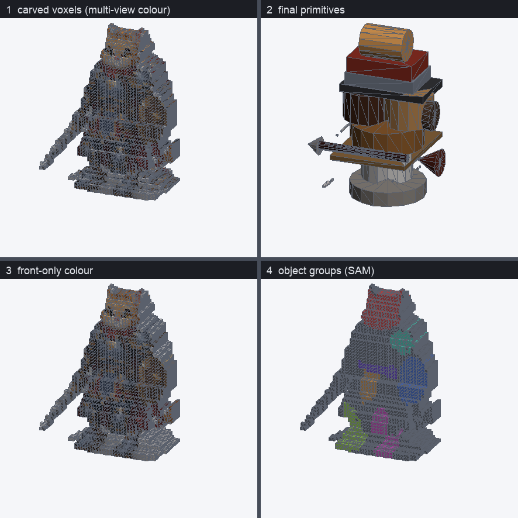

# CubeGB Studio (all-in-one GUI)

CubeGB Studio is a small **local web app** that puts the whole flow on one page:

> **이미지 선택 → `.cgb` 생성 → 3D 뷰 → 내보내기**
> (select image → generate `.cgb` → view in 3D → export)

It is a FastAPI backend that reuses the recognition pipeline and the mesh baker,
with a three.js frontend that reuses CubeGB's renderer.

## Install & run

```bash
pip install -r requirements.txt -r requirements-app.txt
# for the "Generate" step, also install the recognition stack + model weights:
pip install -r requirements-recognition.txt   # see docs/recognition.en.md

python -m app.server          # or, if installed:  cubegb-studio
```

It opens `http://127.0.0.1:8000/` in your browser. **No internet is required** —
three.js is vendored locally under `app/static/vendor/three` (MIT), so Studio
works on offline / firewalled machines where CDNs like `unpkg.com` are blocked.
If the 3D viewer ever fails to load anyway, the rest of the UI (health check,
`.cgb` loading, primitive list, export) keeps working and the viewport shows a
clear message.

Options:

```bash
python -m app.server --host 127.0.0.1 --port 8000 --no-browser
```

You can pre-fill the model checkpoint paths via environment variables:

```bash
export CUBEGB_SAM_CHECKPOINT=/path/to/sam_vit_h_4b8939.pth
export CUBEGB_DEPTH_CHECKPOINT=/path/to/depth_anything_v2.pth   # optional
```

## Using it

1. **이미지 선택** — drag an image onto the drop zone (or click to pick one).
2. **생성** — set the SAM checkpoint path under *생성 옵션* (or via the env var),
   pick a device, and click **생성 (Generate)**. The result loads into the 3D view.
   - No recognition stack installed? Skip generation and click **.cgb 불러오기**
     to view/export an existing `.cgb`.
   - **부위만 골라 3D화** — click **🔍 부위 세분화** to segment the image into parts
     (a thumbnail grid). Tick the parts you want (e.g. just the shield) and
     Generate reconstructs **only those**, each in isolation (a shield → a clean
     disc). Great for building quality one part at a time.
3. **3D 뷰 (2×2 디버그 쿼드)** — the viewport shows four synced panels:
   ① carved voxels (multi-view colour), ② final primitives, ③ front-only colour
   (compare with ①), ④ voxels coloured by SAM object group. Orbit (left-drag),
   pan (right-drag), zoom (wheel); click a primitive in the list to focus it.
4. **내보내기** — download the `.cgb` source, or export **`.glb`** / **`.obj`**
   (baked server-side, low-poly, named parts).



### Orientation toggles (multi-view)

If a multi-view sheet carves with the wrong orientation (the side profile looks
mirrored — face toward the back of the head — or a front-held item merges with a
back one), tick **사이드 좌우 뒤집기 (flip-side)** and/or **탑 앞뒤 뒤집기
(flip-top)** in the multi-view step and regenerate. The depth-axis convention
differs between art tools; the defaults are correct for the bundled sample
sheets.

### Voxel resolution

The *생성 옵션* panel exposes a **voxel resolution** (96–512, default 128) for the
multi-view carving. Carving and primitive-fitting resolutions are **decoupled**,
so a high resolution keeps the voxel panels crisp while primitive fitting stays
fast (~15–20 s even at 256). The voxel `.cgb` carries each voxel's multi-view
colour (`material.color`), front-only colour (cube `name`, hex), and object-group
id (`material.name`, `obj{N}`) — structure kept for future per-object work.

## What needs what

| Action | Requires |
|---|---|
| View a `.cgb`, export `.cgb`/`.glb`/`.obj` | core + `requirements-app.txt` |
| Generate `.cgb` from an image | additionally `requirements-recognition.txt` + model weights + (ideally) a GPU |

The server starts and the **view/export half works even without** the
recognition stack; the *Generate* button returns a clear message telling you
what to install if the dependencies or model weights are missing.

## How it fits together

- `app/server.py` — FastAPI: `GET /` (the page), `GET /api/health`
  (capabilities), `POST /api/generate` (image → `.cgb`, lazy-imports
  `recognition.fit.image_to_cgb`), `POST /api/bake` (`.cgb` → mesh, uses
  `bake.baker`). Only `cgb` + the baker load at startup; the recognition stack is
  imported lazily so a missing dependency never crashes the server.
- `app/static/index.html`, `studio.js` — the UI and flow.
- `app/static/cgb-render.js` — a reusable `CGBViewer` three.js class using the
  same geometry conventions as the baker and the standalone viewer
  (see [cgb-format.md](cgb-format.md)).

> The standalone [`viewer/index.html`](../viewer/index.html) still exists for
> quick, server-less `.cgb` inspection (double-click, drag-and-drop). Studio is
> the integrated workflow.
